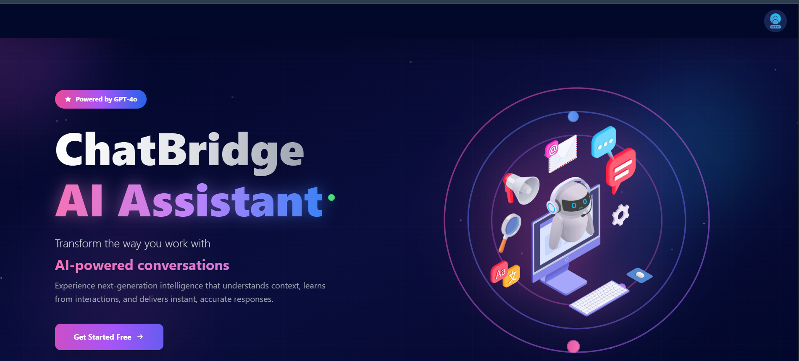
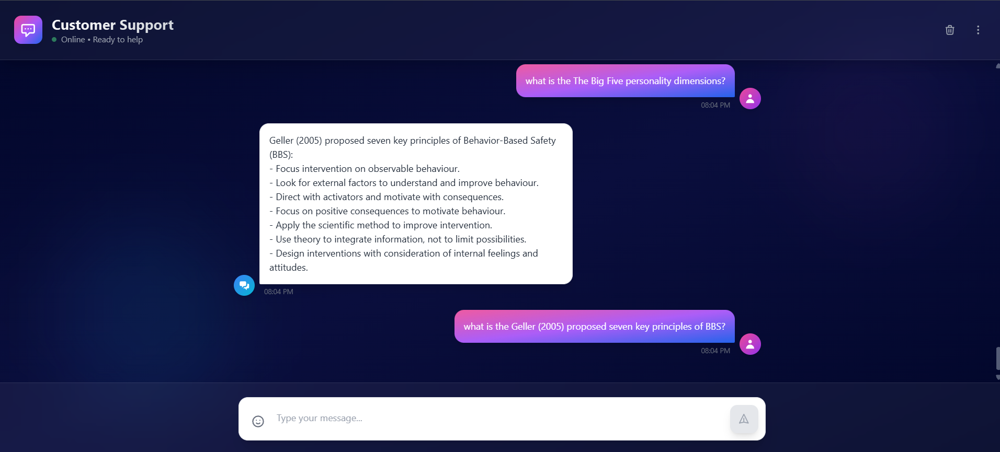

<div align="center">

  <div style="display: flex; justify-content: center; align-items: center; gap: 20px;">
    
    
  </div>

  <h1 style="font-size: 42px;">🚀 ChatBridge Frontend</h1>

  <h3 style="font-size: 22px;">AI-Powered Document Q&A Chat Interface</h3>

  <p>
    <strong>
      A modern, responsive React frontend for <b>ChatBridge</b> — an intelligent chatbot
      that reads PDFs and answers questions using <b>RAG (Retrieval-Augmented Generation)</b>.
    </strong>
  </p>

 
</div>

 
---

### 🔐 **Authentication**
- ✅ **JWT-based Authentication** — Secure token-based auth system  
- ✅ **Persistent Sessions** — Zustand persist middleware for user session management  
- ✅ **Protected Routes** — Automatic redirection for unauthorized users  
- ✅ **Form Validation** — Robust validation using React Hook Form  

---

### 💬 **Chat Features**
- ✅ **Message History** — Persistent chat history fetched from the backend  
- ✅ **Real-time Updates** — Instant message rendering with optimistic UI  
- ✅ **Auto-scroll** — Automatically scrolls to the latest messages  
- ✅ **Message Timestamps** — Track the conversation timeline  
- ✅ **Source Citations** — Shows referenced PDF pages for transparency  

---

## 🎬 **Live Demo**

👉 **[Try ChatBridge](https://chatbridge-lemon.vercel.app/)**

---

###  Installation

1. **Clone the repository**
```
git clonehttps://github.com/symadev/chatbridge.git
```

2. **Navigate to project directory**
```
cd chatbridge
```


3. **Install dependencies**
```
npm install
```
```
yarn install
```


4. **Start development server**
``` 
npm run dev
```
``` 
yarn dev
```


5. **Open your browser**
 ```
 Navigate to http://localhost:5173
 ```

---


## 🧠 Tech Stack

- ⚛️ **React.js** — Frontend library for building dynamic user interfaces  
- 🎨 **Tailwind CSS** — Utility-first CSS framework for modern, responsive styling  
- 🧩 **Zustand** — Lightweight state management for React  
- 📝 **React Hook Form** — Simplified form handling and validation  
- 🌐 **Axios** — Promise-based HTTP client for API communication  
- ⚡ **Vite** — Next-generation frontend build tool for fast development  


